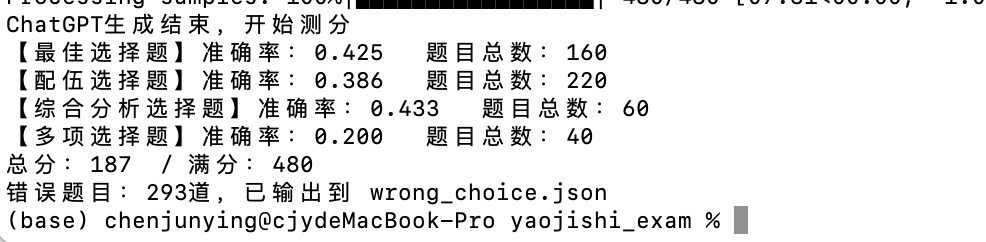
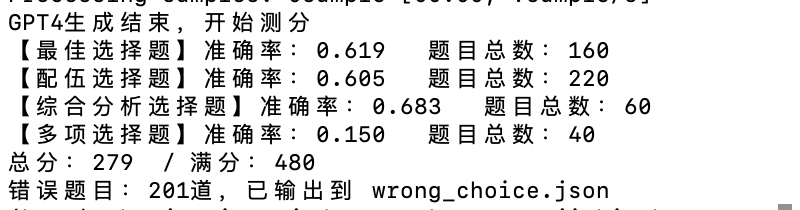

## ChatGPT药剂师考试脚本

#### 介绍

本库用于测试不同prompt对于ChatGPT做题能力的影响，题目采用的是药剂师2021年的完整考试题（四个科目，总共480道），可以自动运行并检测做题得分。


#### 安装

首先需要安装好`GPT`库

```
pip install git+https://github.com/FreedomIntelligence/GPT.git
```


#### 使用

1. 修改系统prompts，请修改`main.py`中的**System_prompt**变量

```
System_prompt = "下面是一道选择题，请先详细分析问题，最后给出选项。\n{question}\n{option}"
```

2. 运行
```
python main.py
```

 在每道问题生成之后，考试结果会自动打印出来，答错的题目会输出到`wrong_choice.json`中。


#### 结果

默认prompt下，ChatGPT的结果：

<div align=center>

</div>


默认prompt下，GPT4的结果：
<div align=center>

</div>
